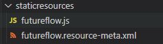

<a href="https://www.npmjs.com/package/future-flow"></a>


<a href="https://www.buymeacoffee.com/allanoricil" target="_blank"></a>

# Future Flow

This project aims to ease the creation of Animated Flow Diagrams using HTML5 Canvas.

[DEMO](https://naughty-dijkstra-92979d.netlify.app)


# Summary
-   [Features](#features)
-   [Supported Browsers](#supported-browsers)
-   [How to Use](#how-to-use)
    -   [Vue Js](#vue-js)
    -   [Salesforce](#salesforce)
    -   [Inline Script](#inline-script)
-   [Documentation](#documentation)

# Features

-   [x] Fully customizable using only Objects.
-   [x] Zoom and Pan
-   [x] Export and Import Flows as JSON.
-   [x] Flow Animations.
-   [ ] Organize Flows using Layers.
-   [ ] Flows of Flows.
-   [ ] Export Flow as GIF.

# How to Use

## Vue Js

First, install the package with npm

```terminal
npm i future-flow --save
```

Then in your Component

```html
<template>
    <div class="d-flex flex-column flex-grow-1 vh-100">
        <canvas id="canvas"></canvas>
    </div>
</template>

<script>
    import { Flow } from 'future-flow'
    export default {
        mounted() {
            const options = {
                background: {
                    color: 'rgb(255,255,255)',
                },
                fps: 60,
                zoom: {
                    level: 1,
                    max: 2,
                    min: 0.2,
                },
                isDebugging: false,
                drawOrigin: true,
                editor: false,
                canMoveBlocks: true,
                autoArrange: false,
            }

            const data = {
                start: {
                    x: 50,
                    y: 72,
                    isDraggable: false,
                    connections: ['stage1'],
                    background: {
                        color: '#12e445',
                    },
                    border: {
                        radius: 20,
                        padding: {
                            top: 50,
                            right: 50,
                            bottom: 50,
                            left: 50,
                        },
                        normal: {
                            width: 2,
                            color: 'transparent',
                        },
                        selected: {
                            width: 2,
                            color: 'black',
                        },
                        hover: {
                            width: 2,
                            color: 'black',
                        },
                    },
                    body: {
                        text: 'Start',
                        alignment: 'start',
                        divider: {
                            width: 1,
                            color: 'rgb(0,0,0)',
                        },
                        font: {
                            family: 'Arial',
                            style: 'normal',
                            variant: 'normal',
                            color: 'rgba(0,0,0,0.6)',
                            size: 20,
                            weight: 'bold',
                        },
                    },
                },
                stage1: {
                    x: 300,
                    y: 45,
                    isDraggable: true,
                    connections: ['end'],
                    border: {
                        radius: 20,
                        normal: {
                            width: 5,
                            color: 'rgba(0,0,0,0.2)',
                        },
                        selected: {
                            width: 2,
                            color: 'black',
                        },
                        hover: {
                            width: 2,
                            color: 'black',
                        },
                    },
                    header: {
                        text: 'Alert',
                        alignment: 'start',
                        font: {
                            family: 'Arial',
                            style: 'normal',
                            variant: 'normal',
                            color: 'rgba(0,0,0,0.6)',
                            size: 20,
                            weight: 'bold',
                        },
                        padding: {
                            top: 15,
                            left: 15,
                            right: 15,
                            bottom: 15,
                        },
                        divider: {
                            color: 'rgba(0,0,0,0.2)',
                            width: 2,
                        },
                    },
                    body: {
                        text: 'New Event Created',
                        alignment: 'start',
                        font: {
                            family: 'Arial',
                            style: 'normal',
                            variant: 'normal',
                            color: 'rgba(0,0,0,0.6)',
                            size: 20,
                            weight: 'bold',
                        },
                    },
                },
                end: {
                    x: 700,
                    y: 72,
                    isDraggable: true,
                    isConnectable: true,
                    canConnect: true,
                    background: {
                        color: 'rgb(255,0,0)',
                    },
                    border: {
                        radius: 20,
                        padding: {
                            top: 50,
                            right: 50,
                            bottom: 50,
                            left: 50,
                        },
                        normal: {
                            width: 2,
                            color: 'transparent',
                        },
                        selected: {
                            width: 2,
                            color: 'black',
                        },
                        hover: {
                            width: 2,
                            color: 'black',
                        },
                    },
                    body: {
                        text: 'End',
                        alignment: 'start',
                        font: {
                            family: 'Arial',
                            style: 'normal',
                            variant: 'normal',
                            color: 'rgba(0,0,0,0.6)',
                            size: 20,
                            weight: 'bold',
                        },
                    },
                },
            }

            // eslint-disable-next-line no-unused-vars
            const flow = new Flow({ options, data })
        },
    }
</script>

<style></style>
```

## Salesforce

Download the library from the [CDN](https://unpkg.com/future-flow@0.0.11/dist/future-flow.js) and deploy it to Salesforce as a Static Resource.



Then create a Lightning Web Component. It is necessary to give a Height to the div that is wrapping the canvas.

### futureflow.html
```html
<template>
    <div class="slds-grid slds-grid_vertical outerdiv">
        <div class="slds-col">
            <canvas lwc:dom="manual">
            </canvas>
        </div>
    </div>
</template>
```
### futureflow.js
```js
import {
    LightningElement
} from 'lwc';

import {
    loadScript
} from 'lightning/platformResourceLoader';
import futureflow from '@salesforce/resourceUrl/futureflow';

export default class Futureflow extends LightningElement {


    connectedCallback() {

        Promise.all([
            loadScript(this, futureflow)
        ]).then(() => {

            const options = {
                background: {
                    color: '#202124',
                },
                fps: 60,
                zoom: {
                    level: 1,
                    max: 2,
                    min: 0.2,
                },
                drawOrigin: true,
                drawGrid: true,
                editor: false,
                canMoveBlocks: true,
                autoArrange: false,
            }
            let data = {
                start: {
                    x: 370,
                    y: 300,
                    isDraggable: true,
                    states: ['start', 'completed'],
                    connections: [{
                            to: 'stage1',
                            isEditable: false,
                            line: {
                                width: 1,
                                color: 'rgb(212,212,212)',
                                dashed: [5, 5],
                            },
                            connector: {
                                type: 'triangle',
                                width: 1,
                                color: 'rgb(212,212,212)',
                                fillColor: 'rgb(212,212,212)',
                            },
                            animation: {
                                speed: 5,
                                type: 'circle',
                                particleDistance: 20,
                                fillColor: 'rgb(247, 129, 244)',
                            },
                        },
                        {
                            to: 'stage1.1',
                            isEditable: false,
                            line: {
                                width: 1,
                                color: 'rgb(212,212,212)',
                                dashed: [5, 5],
                            },
                            connector: {
                                type: 'triangle',
                                width: 1,
                                color: 'rgb(212,212,212)',
                                fillColor: 'rgb(212,212,212)',
                            },
                            animation: {
                                speed: 5,
                                type: 'circle',
                                fillColor: 'rgb(247, 129, 244)',
                                particleDistance: 20,
                            },
                        },
                    ],
                    background: {
                        color: 'rgb(59, 64, 66)',
                    },
                    border: {
                        radius: 10,
                        padding: {
                            top: 50,
                            right: 50,
                            bottom: 50,
                            left: 50,
                        },
                        normal: {
                            width: 1,
                            color: 'transparent',
                        },
                        selected: {
                            width: 1,
                            color: 'transparent',
                        },
                        hover: {
                            width: 1,
                            color: 'transparent',
                        },
                    },
                    body: {
                        text: 'Start',
                        alignment: 'start',
                        divider: {
                            width: 1,
                            color: 'rgb(0,0,0)',
                        },
                        font: {
                            family: 'Arial',
                            style: 'normal',
                            variant: 'normal',
                            color: 'rgb(212,212,212)',
                            size: 20,
                            weight: 'bold',
                        },
                    },
                },
                stage1: {
                    x: 207,
                    y: 434,
                    states: ['start'],
                    isDraggable: true,
                    connections: [{
                        to: 'stage2',
                        isEditable: false,
                        line: {
                            width: 1,
                            color: 'rgb(212,212,212)',
                            dashed: [5, 5],
                        },
                        connector: {
                            type: 'triangle',
                            color: 'rgb(212,212,212)',
                            fillColor: 'rgb(212,212,212)',
                        },
                        animation: {
                            speed: 5,
                            type: 'circle',
                            fillColor: 'rgb(247, 129, 244)',
                            particleDistance: 20,
                        },
                    }, ],
                    background: {
                        color: 'rgb(59, 64, 66)',
                    },
                    border: {
                        radius: 20,
                        normal: {
                            width: 1,
                            color: 'transparent',
                        },
                        selected: {
                            width: 1,
                            color: 'transparent',
                        },
                        hover: {
                            width: 1,
                            color: 'transparent',
                        },
                    },
                    header: {
                        text: 'Build',
                        alignment: 'center',
                        font: {
                            family: 'Arial',
                            style: 'normal',
                            variant: 'normal',
                            color: 'rgb(212,212,212)',
                            size: 20,
                            weight: 'bold',
                        },
                        padding: {
                            top: 15,
                            left: 15,
                            right: 15,
                            bottom: 15,
                        },
                        divider: {
                            color: 'transparent',
                            width: 1,
                        },
                    },
                    body: {
                        text: 'Checking Out...',
                        alignment: 'start',
                        font: {
                            family: 'Arial',
                            style: 'normal',
                            variant: 'normal',
                            color: 'rgb(212,212,212)',
                            size: 20,
                            weight: 'bold',
                        },
                    },
                },
                'stage1.1': {
                    x: 548,
                    y: 434,
                    isDraggable: true,
                    states: ['start'],
                    connections: [{
                        to: 'stage2',
                        isEditable: false,
                        line: {
                            width: 1,
                            color: 'rgb(212,212,212)',
                            dashed: [5, 5],
                        },
                        connector: {
                            type: 'triangle',
                            color: 'rgb(212,212,212)',
                            fillColor: 'rgb(212,212,212)',
                        },
                        animation: {
                            speed: 5,
                            type: 'circle',
                            fillColor: 'rgb(247, 129, 244)',
                            particleDistance: 20,
                        },
                    }, ],
                    background: {
                        color: 'rgb(59, 64, 66)',
                    },
                    border: {
                        radius: 20,
                        normal: {
                            width: 1,
                            color: 'transparent',
                        },
                        selected: {
                            width: 1,
                            color: 'transparent',
                        },
                        hover: {
                            width: 1,
                            color: 'transparent',
                        },
                    },
                    header: {
                        text: 'Test',
                        alignment: 'center',
                        font: {
                            family: 'Arial',
                            style: 'normal',
                            variant: 'normal',
                            color: 'rgb(212,212,212)',
                            size: 20,
                            weight: 'bold',
                        },
                        padding: {
                            top: 15,
                            left: 15,
                            right: 15,
                            bottom: 15,
                        },
                        divider: {
                            color: 'transparent',
                            width: 1,
                        },
                    },
                    body: {
                        text: 'Queued',
                        alignment: 'start',
                        font: {
                            family: 'Arial',
                            style: 'normal',
                            variant: 'normal',
                            color: 'rgb(212,212,212)',
                            size: 20,
                            weight: 'bold',
                        },
                    },
                },
                stage2: {
                    x: 350,
                    y: 660,
                    isDraggable: true,
                    states: ['start'],
                    connections: [{
                        to: 'stage3',
                        isEditable: false,
                        line: {
                            width: 1,
                            color: 'rgb(212,212,212)',
                            dashed: [5, 5],
                        },
                        connector: {
                            type: 'triangle',
                            color: 'rgb(212,212,212)',
                            fillColor: 'rgb(212,212,212)',
                        },
                        animation: {
                            speed: 5,
                            type: 'circle',
                            fillColor: 'rgb(247, 129, 244)',
                            particleDistance: 20,
                        },
                    }, ],
                    background: {
                        color: 'rgb(59, 64, 66)',
                    },
                    border: {
                        radius: 20,
                        normal: {
                            width: 1,
                            color: 'transparent',
                        },
                        selected: {
                            width: 1,
                            color: 'transparent',
                        },
                        hover: {
                            width: 1,
                            color: 'transparent',
                        },
                    },
                    header: {
                        text: 'Test',
                        alignment: 'center',
                        font: {
                            family: 'Arial',
                            style: 'normal',
                            variant: 'normal',
                            color: 'rgb(212,212,212)',
                            size: 20,
                            weight: 'bold',
                        },
                        padding: {
                            top: 15,
                            left: 15,
                            right: 15,
                            bottom: 15,
                        },
                        divider: {
                            color: 'transparent',
                            width: 1,
                        },
                    },
                    body: {
                        text: 'Queued',
                        alignment: 'start',
                        font: {
                            family: 'Arial',
                            style: 'normal',
                            variant: 'normal',
                            color: 'rgb(212,212,212)',
                            size: 20,
                            weight: 'bold',
                        },
                    },
                },
                stage3: {
                    x: 298,
                    y: 893,
                    isDraggable: true,
                    states: ['start'],
                    connections: [{
                        to: 'end',
                        isEditable: false,
                        line: {
                            width: 1,
                            color: 'rgb(212,212,212)',
                            dashed: [5, 5],
                        },
                        connector: {
                            type: 'triangle',
                            color: 'rgb(212,212,212)',
                            fillColor: 'rgb(212,212,212)',
                        },
                        animation: {
                            speed: 5,
                            type: 'circle',
                            fillColor: 'rgb(247, 129, 244)',
                            particleDistance: 20,
                        },
                    }, ],
                    background: {
                        color: 'rgb(59, 64, 66)',
                    },
                    border: {
                        radius: 20,
                        normal: {
                            width: 1,
                            color: 'transparent',
                        },
                        selected: {
                            width: 1,
                            color: 'transparent',
                        },
                        hover: {
                            width: 1,
                            color: 'transparent',
                        },
                    },
                    header: {
                        text: 'Release',
                        alignment: 'center',
                        font: {
                            family: 'Arial',
                            style: 'normal',
                            variant: 'normal',
                            color: 'rgb(212,212,212)',
                            size: 20,
                            weight: 'bold',
                        },
                        padding: {
                            top: 15,
                            left: 15,
                            right: 15,
                            bottom: 15,
                        },
                        divider: {
                            color: 'transparent',
                            width: 1,
                        },
                    },
                    body: {
                        text: 'Queued',
                        alignment: 'start',
                        font: {
                            family: 'Arial',
                            style: 'normal',
                            variant: 'normal',
                            color: 'rgb(212,212,212)',
                            size: 20,
                            weight: 'bold',
                        },
                    },
                },
                end: {
                    x: 604,
                    y: 869,
                    isDraggable: true,
                    isConnectable: true,
                    canConnect: true,
                    background: {
                        color: 'rgb(59, 64, 66)',
                    },
                    border: {
                        radius: 20,
                        padding: {
                            top: 50,
                            right: 50,
                            bottom: 50,
                            left: 50,
                        },
                        normal: {
                            width: 1,
                            color: 'transparent',
                        },
                        selected: {
                            width: 1,
                            color: 'transparent',
                        },
                        hover: {
                            width: 1,
                            color: 'transparent',
                        },
                    },
                    body: {
                        text: 'End',
                        alignment: 'start',
                        font: {
                            family: 'Arial',
                            style: 'normal',
                            variant: 'normal',
                            color: 'rgb(212,212,212)',
                            size: 20,
                            weight: 'bold',
                        },
                    },
                },
            }

            const canvas = this.template.querySelector('canvas');

            const flow = new futureFlow.Flow({
                canvas,
                options,
                data,
            })

            //Changing the block status will dispatch an Event that can be hooked with a Callback
            setTimeout(() => {
                flow.getEntityByName('start').state = 'start'
            }, 3000)

            setTimeout(() => {
                flow.getEntityByName('stage1').state = 'start'
            }, 6000)

            setTimeout(() => {
                flow.getEntityByName('stage1.1').state = 'start'
            }, 6000)

            setTimeout(() => {
                flow.getEntityByName('stage2').state = 'start'
            }, 12000)

            setTimeout(() => {
                flow.getEntityByName('stage3').state = 'start'
            }, 18000)

            //Block Status Event Callback
            flow.getEntityByName('start').on('start', e => {
                flow.getEntityByName('start').startAllAnimations()
            })

            flow.getEntityByName('stage1').on('start', e => {
                flow.getEntityByName('stage1').startAllAnimations()
            })

            flow.getEntityByName('stage1.1').on('start', e => {
                flow.getEntityByName('stage1.1').startAllAnimations()
            })

            flow.getEntityByName('stage2').on('start', e => {
                flow.getEntityByName('stage2').startAllAnimations()
            })

            flow.getEntityByName('stage3').on('start', e => {
                flow.getEntityByName('stage3').startAllAnimations()
            })
        })
    }
}
```

### futureflow.css
```css
.outerdiv {
    height: 800px;
}
```

### futureflow.js-meta.xml
```xml
<?xml version="1.0" encoding="UTF-8" ?>
<LightningComponentBundle xmlns="http://soap.sforce.com/2006/04/metadata">
    <apiVersion>48.0</apiVersion>
    <isExposed>true</isExposed>
    <targets>
        <target>lightning__HomePage</target>
        <target>lightning__AppPage</target>
    </targets>
</LightningComponentBundle>
```


## Inline Script

Import the script from the npm CDN

```html
<script src="https://unpkg.com/future-flow@0.0.11/dist/future-flow.js"></script>
```

Then just initialize the flow using an instance of `futureFlow.Flow({ options, data })`

```html
<html>
    <head>
        <script src="https://unpkg.com/future-flow@0.0.11/dist/future-flow.js"></script>
    </head>
    <body>
        <canvas id="canvas"></canvas>
    </body>

    <script>
        const options = {
            background: {
                color: '#202124',
            },
            zoom: {
                level: futureFlow.isMobile() ? 0.8 : 1,
                max: 2,
                min: 0.2,
            },
            drawOrigin: false,
            drawGrid: true,
            editor: false,
            canMoveBlocks: false,
            canDragCanvas: false,
            autoArrange: false,
        }

        let data = {
            start: {
                position: {
                    x: 216,
                    y: 31,
                },
                isDraggable: true,
                states: ['start', 'completed'],
                connections: [{
                    to: 'condition1',
                    isEditable: false,
                    line: {
                        weight: 1,
                        color: 'rgb(212,212,212)',
                        enableBezierCurves: true,
                        dashed: [5, 5],
                    },
                    connector: {
                        shape: 'triangle',
                        dimension: {
                            width: 10,
                            height: 10
                        },
                        color: 'rgb(212,212,212)',
                        fillColor: 'rgb(212,212,212)',
                    },
                    animation: {
                        speed: 5,
                        type: 'circle',
                        particleDistance: 20,
                        fillColor: 'rgb(247, 129, 244)',
                    },
                }, ],
                background: {
                    color: {
                        red: 59,
                        green: 64,
                        blue: 66,
                    },
                },
                shadow: {
                    offsetX: 10,
                    offsetY: 10,
                    color: 'black',
                    blur: 0
                },
                border: {
                    radius: 10,
                    padding: {
                        top: 50,
                        right: 50,
                        bottom: 50,
                        left: 50,
                    },
                    lineWidth: 1,
                    color: {
                        red: 59,
                        green: 64,
                        blue: 66,
                    },
                    selected: {
                        lineWidth: 1,
                        color: {
                            red: 59,
                            green: 64,
                            blue: 66,
                        },
                    },
                    hover: {
                        lineWidth: 1,
                        color: {
                            red: 59,
                            green: 64,
                            blue: 66,
                        },
                    },
                },
                body: {
                    text: 'Start',
                    alignment: 'start',
                    divider: {
                        width: 1,
                        color: 'rgb(0,0,0)',
                    },
                    font: {
                        family: 'Arial',
                        style: 'normal',
                        variant: 'normal',
                        color: 'rgb(212,212,212)',
                        size: 20,
                        weight: 'bold',
                    },
                },
            },
            condition1: {
                position: {
                    x: 164,
                    y: 176,
                },
                isDraggable: true,
                type: 'conditional',
                states: ['start', 'completed'],
                connections: [{
                        to: 'yes',
                        isEditable: false,
                        line: {
                            weight: 1,
                            color: 'rgb(212,212,212)',
                            enableBezierCurves: true,
                            dashed: [5, 5],
                        },
                        connector: {
                            shape: 'triangle',
                            dimension: {
                                width: 10,
                                height: 10
                            },
                            color: 'rgb(212,212,212)',
                            fillColor: 'rgb(212,212,212)',
                        },
                        animation: {
                            speed: 5,
                            type: 'circle',
                            particleDistance: 20,
                            fillColor: 'rgb(247, 129, 244)',
                        },
                    },
                    {
                        to: 'no',
                        isEditable: false,
                        line: {
                            weight: 1,
                            color: 'rgb(212,212,212)',
                            enableBezierCurves: true,
                            dashed: [5, 5],
                        },
                        connector: {
                            shape: 'triangle',
                            dimension: {
                                width: 10,
                                height: 10
                            },
                            color: 'rgb(212,212,212)',
                            fillColor: 'rgb(212,212,212)',
                        },
                        animation: {
                            speed: 5,
                            type: 'circle',
                            fillColor: 'rgb(247, 129, 244)',
                            particleDistance: 20,
                        },
                    },
                ],
                background: {
                    color: 'rgb(59, 64, 66)',
                },
                padding: {
                    top: 50,
                    right: 50,
                    bottom: 50,
                    left: 50,
                },
                shadow: {
                    offsetX: 10,
                    offsetY: 10,
                    color: 'black',
                    blur: 0
                },
                border: {
                    radius: 10,
                    lineWidth: 1,
                    color: 'rgb(212, 212, 212)',
                    selected: {
                        lineWidth: 1,
                        color: 'rgb(212, 212, 212)',
                    },
                    hover: {
                        lineWidth: 1,
                        color: 'rgb(212, 212, 212)',
                    },
                },
                body: {
                    text: 'OS == Win32',
                    alignment: 'start',
                    divider: {
                        width: 1,
                        color: 'rgb(0,0,0)',
                    },
                    font: {
                        family: 'Arial',
                        style: 'normal',
                        variant: 'normal',
                        color: 'rgb(212,212,212)',
                        size: 20,
                        weight: 'bold',
                    },
                },
            },
            yes: {
                position: {
                    x: 51,
                    y: 362,
                },
                states: ['stage2'],
                isDraggable: true,
                connections: [{
                    to: 'stage2',
                    isEditable: false,
                    line: {
                        weight: 1,
                        color: 'rgb(212,212,212)',
                        enableBezierCurves: true,
                        dashed: [5, 5],
                    },
                    connector: {
                        shape: 'triangle',
                        dimension: {
                            width: 10,
                            height: 10
                        },
                        color: 'rgb(212,212,212)',
                        fillColor: 'rgb(212,212,212)',
                    },
                    animation: {
                        speed: 5,
                        type: 'circle',
                        fillColor: 'rgb(247, 129, 244)',
                        particleDistance: 20,
                    },
                }, ],
                background: {
                    color: 'rgb(59, 64, 66)',
                },
                shadow: {
                    offsetX: 10,
                    offsetY: 10,
                    color: 'black',
                    blur: 0
                },
                border: {
                    radius: 20,
                    lineWidth: 1,
                    color: 'rgb(212, 212, 212)',
                    selected: {
                        lineWidth: 1,
                        color: 'rgb(212, 212, 212)',
                    },
                    hover: {
                        lineWidth: 1,
                        color: 'rgb(212, 212, 212)',
                    },
                },
                header: {
                    text: 'Build',
                    alignment: 'center',
                    icon: {
                        src: 'https://imagens.canaltech.com.br/empresas/690.400.jpg',
                        position: {
                            x: 0,
                            y: 0,
                        },
                        dimension: {
                            width: 25,
                            height: 25,
                        },
                    },
                    font: {
                        family: 'Arial',
                        style: 'normal',
                        variant: 'normal',
                        color: 'rgb(212,212,212)',
                        size: 20,
                        weight: 'bold',
                    },
                    padding: {
                        top: 15,
                        left: 0,
                        right: 15,
                        bottom: 15,
                    },
                    divider: {
                        color: 'rgb(212, 212, 212)',
                        width: 1,
                    },
                },
                body: {
                    text: 'Windows',
                    alignment: 'start',
                    font: {
                        family: 'Arial',
                        style: 'normal',
                        variant: 'normal',
                        color: 'rgb(212,212,212)',
                        size: 20,
                        weight: 'bold',
                    },
                },
            },
            no: {
                position: {
                    x: 350,
                    y: 357,
                },
                isDraggable: true,
                states: ['stage2'],
                connections: [{
                    to: 'stage2',
                    isEditable: false,
                    line: {
                        weight: 1,
                        color: 'rgb(212,212,212)',
                        enableBezierCurves: true,
                        dashed: [5, 5],
                    },
                    connector: {
                        shape: 'triangle',
                        dimension: {
                            width: 10,
                            height: 10
                        },
                        color: 'rgb(212,212,212)',
                        fillColor: 'rgb(212,212,212)',
                    },
                    animation: {
                        speed: 5,
                        type: 'circle',
                        fillColor: 'rgb(247, 129, 244)',
                        particleDistance: 20,
                    },
                }, ],
                background: {
                    color: 'rgb(59, 64, 66)',
                },
                shadow: {
                    offsetX: 10,
                    offsetY: 10,
                    color: 'black',
                    blur: 0
                },
                border: {
                    radius: 20,
                    lineWidth: 1,
                    color: 'rgb(212, 212, 212)',
                    selected: {
                        lineWidth: 1,
                        color: 'rgb(212, 212, 212)',
                    },
                    hover: {
                        lineWidth: 1,
                        color: 'rgb(212, 212, 212)',
                    },
                },
                header: {
                    text: 'Build',
                    alignment: 'center',
                    font: {
                        family: 'Arial',
                        style: 'normal',
                        variant: 'normal',
                        color: 'rgb(212,212,212)',
                        size: 20,
                        weight: 'bold',
                    },
                    padding: {
                        top: 15,
                        left: 15,
                        right: 15,
                        bottom: 15,
                    },
                    divider: {
                        color: 'rgb(212, 212, 212)',
                        width: 1,
                    },
                },
                body: {
                    text: 'Linux',
                    alignment: 'start',
                    font: {
                        family: 'Arial',
                        style: 'normal',
                        variant: 'normal',
                        color: 'rgb(212,212,212)',
                        size: 20,
                        weight: 'bold',
                    },
                },
            },
            stage2: {
                position: {
                    x: 196,
                    y: 580,
                },
                isDraggable: true,
                states: ['start'],
                connections: [{
                    to: 'end',
                    isEditable: false,
                    line: {
                        weight: 1,
                        color: 'rgb(212,212,212)',
                        enableBezierCurves: true,
                        dashed: [5, 5],
                    },
                    connector: {
                        shape: 'triangle',
                        dimension: {
                            width: 10,
                            height: 10
                        },
                        color: 'rgb(212,212,212)',
                        fillColor: 'rgb(212,212,212)',
                    },
                    animation: {
                        speed: 5,
                        type: 'circle',
                        fillColor: 'rgb(247, 129, 244)',
                        particleDistance: 20,
                    },
                }, ],
                background: {
                    color: 'rgb(59, 64, 66)',
                },
                shadow: {
                    offsetX: 10,
                    offsetY: 10,
                    color: 'black',
                    blur: 0
                },
                border: {
                    radius: 20,
                    lineWidth: 1,
                    color: 'rgb(212, 212, 212)',
                    selected: {
                        lineWidth: 1,
                        color: 'rgb(212, 212, 212)',
                    },
                    hover: {
                        lineWidth: 1,
                        color: 'rgb(212, 212, 212)',
                    },
                },
                header: {
                    text: 'Deploy',
                    alignment: 'center',
                    font: {
                        family: 'Arial',
                        style: 'normal',
                        variant: 'normal',
                        color: 'rgb(212,212,212)',
                        size: 20,
                        weight: 'bold',
                    },
                    padding: {
                        top: 15,
                        left: 15,
                        right: 15,
                        bottom: 15,
                    },
                    divider: {
                        color: 'rgb(212, 212, 212)',
                        width: 1,
                    },
                },
                body: {
                    text: 'Sandbox',
                    alignment: 'start',
                    font: {
                        family: 'Arial',
                        style: 'normal',
                        variant: 'normal',
                        color: 'rgb(212,212,212)',
                        size: 20,
                        weight: 'bold',
                    },
                },
            },
            end: {
                position: {
                    x: 219,
                    y: 773,
                },
                isDraggable: true,
                isConnectable: true,
                canConnect: true,
                background: {
                    color: 'rgb(59, 64, 66)',
                },
                shadow: {
                    offsetX: 10,
                    offsetY: 10,
                    color: 'black',
                    blur: 0
                },
                border: {
                    radius: 20,
                    lineWidth: 1,
                    color: 'rgb(212, 212, 212)',
                    selected: {
                        lineWidth: 1,
                        color: 'rgb(212, 212, 212)',
                    },
                    hover: {
                        lineWidth: 1,
                        color: 'rgb(212, 212, 212)',
                    },
                },
                padding: {
                    top: 50,
                    right: 50,
                    bottom: 50,
                    left: 50,
                },
                body: {
                    text: 'End',
                    alignment: 'start',
                    font: {
                        family: 'Arial',
                        style: 'normal',
                        variant: 'normal',
                        color: 'rgb(212,212,212)',
                        size: 20,
                        weight: 'bold',
                    },
                },
            },
        }

        const flow = new futureFlow.Flow({
            options,
            data,
        })
    </script>
</html>
```

# Documentation

## Flow

| Property | Type              | Description                                                                           |
| -------- | ----------------- | ------------------------------------------------------------------------------------- |
| options  | Object            | Object to configure the flow.                                                         |
| data     | Object            | Each Key is a Block that will be drawn in the Flow.                                   |
| canvas   | Object (Optional) | HTML Canvas Element. The Flow automatically picks up the canvas with an id = "canvas" |

## Flow.Options

| Property      | Type               | Description                                                                                                 |
| ------------- | ------------------ | ----------------------------------------------------------------------------------------------------------- |
| background    | Object (Optional)  | Object to configure the background of the Flow.                                                             |
| fps           | Number (Optional)  | Frame rate for the animations.                                                                              |
| zoom          | Object (Optional)  | Object to configure Initial Zoom, Max and Min Zoom levels.                                                  |
| drawOrigin    | Boolean (Optional) | Draw the Flows' origin point. Defaults to false.                                                            |
| drawGrid      | Boolean (Optional) | Draw the Grid lines. Defaults to false.                                                                     |
| editor        | Boolean (Optional) | Enable the editor. Defaults to false.                                                                       |
| canMoveBlocks | Boolean (Optional) | Enable use to move the Entities with the mouse. Defaults to true.                                           |
| autoArrange   | Boolean (Optional) | If true it will auto arrange the entities. It overrides properties X and Y in the Entity.Defaults to false. |

## Flow.Options.Background

| Property | Type              | Description                                                                                                                                       |
| -------- | ----------------- | ------------------------------------------------------------------------------------------------------------------------------------------------- |
| color    | String (Optional) | It can have the following formats: </br> rgb(0, 0, 0) </br> rgba(0,0,0,0)</br> #FFF </br> #FFFFFF </br> Defaults to Transparent if not specified. |

## Flow.Options.Zoom

| Property | Type             | Description                                                                           |
| -------- | ---------------- | ------------------------------------------------------------------------------------- |
| level    | Number(Optional) | Represents the initial Scale things will be drawn. If not specified it defaults to 1. |
| max      | Number(Optional) | The Maximum value for the Scale. If not specified it defaults to 2.                   |
| min      | Number(Optional) | The Minimum value for the Scale. If not specified it defaults to 0.2.                 |

## Flow.Data

| Property | Type   | Description                                                      |
| -------- | ------ | ---------------------------------------------------------------- |
| data     | Object | Each key represents a block. The key is the "name" of an entity. |

## Flow.Data.Entity

| Property    | Type            | Description                                                                                                                                                                                                                                               |
| ----------- | --------------- | --------------------------------------------------------------------------------------------------------------------------------------------------------------------------------------------------------------------------------------------------------- |
| x           | Number          | Entity position relative to the X axis.                                                                                                                                                                                                                   |
| y           | Number          | Entity position relative to the Y axis.                                                                                                                                                                                                                   |
| isDraggable | Boolean         | If true the block can dragged using the mouse.                                                                                                                                                                                                            |
| states      | Array of String | Array of Event Names. Each entry corresponds to a state a block can have. </br> When the state is changed the block emmits an event that can be hooked with a callback function. </br>Example: </br>`flow.getEntityByName('start').on('start', callback)` |
| connections | Array of Object | Each Entry is a Connection Object.                                                                                                                                                                                                                        |
| background  | Object          | An object to configure the background of an entity.                                                                                                                                                                                                       |
| border      | Object          | An object to configure the borders of an entity                                                                                                                                                                                                           |
| header      | Object          | An object to configure the content on the Top of an entity.                                                                                                                                                                                               |
| body        | Object          | An object to configure the content on the Middle of an entity.                                                                                                                                                                                            |
| footer      | Object          | An object to configure the content at the bottom of an entity.                                                                                                                                                                                            |

## Flow.Data.Entity.Connection

| Property   | Type               | Description                                                                                            |
| ---------- | ------------------ | ------------------------------------------------------------------------------------------------------ |
| to         | String (Optional)  | Name of the Entity to connect to. It has to be exactly the same name used as the key in the Flow.Data. |
| isEditable | Boolean (Optional) | If true you can edit the Points that forms the Connection.                                             |
| line       | Object (Optional)  | Object to configure the connection's style.                                                            |
| connector  | Object (Optional)  | Object to configure the Connector symbol.                                                              |
| animation  | Object (Optional)  | Object to Configure the flow Animation.                                                                |

## Flow.Data.Entity.Connection.Line

| Property    | Type               | Description                                                                                                                                                                                                                                     |
| ----------- | ------------------ | ----------------------------------------------------------------------------------------------------------------------------------------------------------------------------------------------------------------------------------------------- |
| width       | Number (Optional)  | It controls the thickness of the line.                                                                                                                                                                                                          |
| color       | String (Optional)  | It is the color of the line. It can have the following formats: </br> rgb(0, 0, 0) </br> rgba(0,0,0,0)</br> #FFF </br> #FFFFFF </br> Defaults to Transparent if not specified.                                                                  |
| bezierCurve | Boolean (Optional) | If set to true the lines will be curves. It defaults to false.                                                                                                                                                                                  |
| dashed      | Array (Optional)   | It specified the lines will be dashed. It acceepts Arrays of Integer, like: </br> [5 , 5], </br> [5 , 5, 5] </br> For more details use this [reference](https://developer.mozilla.org/en-US/docs/Web/API/CanvasRenderingContext2D/setLineDash). |

## Flow.Data.Entity.Connection.Connector

| Property  | Type              | Description                                                                                                                                                                                          |
| --------- | ----------------- | ---------------------------------------------------------------------------------------------------------------------------------------------------------------------------------------------------- |
| type      | String (Optional) | It accepts: </br> circle </br> triangle </br> It defaults to triangle.                                                                                                                               |
| width     | Number (Optional) | It controls the thickness of the line.                                                                                                                                                               |
| color     | String (Optional) | It controls the color of the line. It can have the following formats: </br> rgb(0, 0, 0) </br> rgba(0,0,0,0)</br> #FFF </br> #FFFFFF </br> Defaults to Transparent if not specified.                 |
| fillColor | String (Optional) | It controls the color the triangle is filled with. It can have the following formats: </br> rgb(0, 0, 0) </br> rgba(0,0,0,0)</br> #FFF </br> #FFFFFF </br> Defaults to Transparent if not specified. |

## Flow.Data.Entity.Connection.Animation

| Property         | Type              | Description                                                                                                                                                                       |
| ---------------- | ----------------- | --------------------------------------------------------------------------------------------------------------------------------------------------------------------------------- |
| speed            | Number (Optional) | It controls the speed the flow particle moves.                                                                                                                                    |
| type             | String (Optional) | It sets the type of particle used. It can be circle or triangle. If not specified it defaults to circle.                                                                          |
| particleDistance | Number (Optional) | It controls the distance between each particle during the flow Animation.                                                                                                         |
| fillColor        | String (Optional) | It is the color of the particle. It can have the following formats: </br> rgb(0, 0, 0) </br> rgba(0,0,0,0)</br> #FFF </br> #FFFFFF </br> Defaults to Transparent if not specified |

## Flow.Data.Entity.Background

| Property | Type              | Description                                                                                                                                       |
| -------- | ----------------- | ------------------------------------------------------------------------------------------------------------------------------------------------- |
| color    | String (Optional) | It can have the following formats: </br> rgb(0, 0, 0) </br> rgba(0,0,0,0)</br> #FFF </br> #FFFFFF </br> Defaults to Transparent if not specified. |

## Flow.Data.Entity.Border

| Property | Type             | Description                                                                                |
| -------- | ---------------- | ------------------------------------------------------------------------------------------ |
| radius   | Number(Optional) | It rounds the border if it is greater than 0                                               |
| padding  | Object(Optional) | It is an Object to control the internal distances from each border.                        |
| normal   | Object(Optional) | It is an Object to control the Border's Width and Color.                                   |
| selected | Object(Optional) | It is an Object to control the Border's Width and Color when the Entity is Clicked.        |
| hover    | Object(Optional) | It is an Object to control the Border's Width and Color when the Mouse is Over the Entity. |

## Flow.Data.Entity.Border.Padding

| Property | Type             | Description                                                                    |
| -------- | ---------------- | ------------------------------------------------------------------------------ |
| top      | Number(Optional) | It is the distance measured from top border to the inner content in pixels.    |
| right    | Number(Optional) | It is the distance measured from right border to the inner content in pixels.  |
| bottom   | Number(Optional) | It is the distance measured from bottom border to the inner content in pixels. |
| left     | Number(Optional) | It is the distance measured from left border to the inner content in pixels.   |

## Flow.Data.Entity.Border.Normal

| Property | Type              | Description                                                                                                                                       |
| -------- | ----------------- | ------------------------------------------------------------------------------------------------------------------------------------------------- |
| width    | Number(Optional)  | It is the thickness of the border.                                                                                                                |
| color    | String (Optional) | It can have the following formats: </br> rgb(0, 0, 0) </br> rgba(0,0,0,0)</br> #FFF </br> #FFFFFF </br> Defaults to Transparent if not specified. |

## Flow.Data.Entity.Border.Selected

| Property | Type              | Description                                                                                                                                                                                                   |
| -------- | ----------------- | ------------------------------------------------------------------------------------------------------------------------------------------------------------------------------------------------------------- |
| width    | Number(Optional)  | It is the thickness of the border when Selected.                                                                                                                                                              |
| color    | String (Optional) | It is the Border's Color when the Entity is Selected. </br> It can have the following formats: </br> rgb(0, 0, 0) </br> rgba(0,0,0,0)</br> #FFF </br> #FFFFFF </br> Defaults to Transparent if not specified. |

## Flow.Data.Entity.Border.Hover

| Property | Type              | Description                                                                                                                                                                                                         |
| -------- | ----------------- | ------------------------------------------------------------------------------------------------------------------------------------------------------------------------------------------------------------------- |
| width    | Number(Optional)  | It is the thickness of the border.                                                                                                                                                                                  |
| color    | String (Optional) | It is the Border's Color when the mouse is over the Entity. </br> It can have the following formats: </br> rgb(0, 0, 0) </br> rgba(0,0,0,0)</br> #FFF </br> #FFFFFF </br> Defaults to Transparent if not specified. |

## Flow.Data.Entity.Header

| Property  | Type             | Description                                                                                                                      |
| --------- | ---------------- | -------------------------------------------------------------------------------------------------------------------------------- |
| text      | String           | Text that will be displayed in the Header.                                                                                       |
| alignment | String(Optional) | If start the text is drawn from left to right. If it is center the text is centered. </br>It Defaults to start if not specified. |
| divider   | Object(Optional) | Object to configure the divider line between the Header and the Body.                                                            |
| font      | Object           | Object to configure the Font the text will be written with.                                                                      |

## Flow.Data.Entity.Header.Divider

| Property | Type              | Description                                                                                                                                       |
| -------- | ----------------- | ------------------------------------------------------------------------------------------------------------------------------------------------- |
| width    | Number(Optional)  | Line Tickness                                                                                                                                     |
| color    | String (Optional) | It can have the following formats: </br> rgb(0, 0, 0) </br> rgba(0,0,0,0)</br> #FFF </br> #FFFFFF </br> Defaults to Transparent if not specified. |

## Flow.Data.Entity.Header.Font

| Property | Type              | Description                                                                                                                                       |
| -------- | ----------------- | ------------------------------------------------------------------------------------------------------------------------------------------------- |
| family   | String(Optional)  | Font Family.                                                                                                                                      |
| style    | String(Optional)  | It accepts: normal, italic or oblique.                                                                                                            |
| variant  | String(Optional)  | It accepts: normal or small-caps.                                                                                                                 |
| color    | String (Optional) | It can have the following formats: </br> rgb(0, 0, 0) </br> rgba(0,0,0,0)</br> #FFF </br> #FFFFFF </br> Defaults to Transparent if not specified. |
| size     | Number(Optional)  | Font Size.                                                                                                                                        |
| weight   | String(Optional)  | It accepts: normal, bold, bolder, lighter, or a number passed as a String.                                                                        |

## Flow.Data.Entity.Body

| Property  | Type             | Description                                                                                                                      |
| --------- | ---------------- | -------------------------------------------------------------------------------------------------------------------------------- |
| text      | String           | Text that will be displayed in the Body.                                                                                         |
| alignment | String(Optional) | If start the text is drawn from left to right. If it is center the text is centered. </br>It Defaults to start if not specified. |
| divider   | Object(Optional) | Object to configure the divider line between the Body and the Footer.                                                            |
| font      | Object           | Object to configure the Font the text will be written with.                                                                      |

## Flow.Data.Entity.Body.Divider

| Property | Type              | Description                                                                                                                                       |
| -------- | ----------------- | ------------------------------------------------------------------------------------------------------------------------------------------------- |
| width    | Number(Optional)  | Line Tickness                                                                                                                                     |
| color    | String (Optional) | It can have the following formats: </br> rgb(0, 0, 0) </br> rgba(0,0,0,0)</br> #FFF </br> #FFFFFF </br> Defaults to Transparent if not specified. |

## Flow.Data.Entity.Body.Font

| Property | Type              | Description                                                                                                                                       |
| -------- | ----------------- | ------------------------------------------------------------------------------------------------------------------------------------------------- |
| family   | String(Optional)  | Font Family.                                                                                                                                      |
| style    | String(Optional)  | It accepts: normal, italic or oblique.                                                                                                            |
| variant  | String(Optional)  | It accepts: normal or small-caps.                                                                                                                 |
| color    | String (Optional) | It can have the following formats: </br> rgb(0, 0, 0) </br> rgba(0,0,0,0)</br> #FFF </br> #FFFFFF </br> Defaults to Transparent if not specified. |
| size     | Number(Optional)  | Font Size.                                                                                                                                        |
| weight   | String(Optional)  | It accepts: normal, bold, bolder, lighter, or a number passed as a String.                                                                        |

## Flow.Data.Entity.Footer

| Property  | Type             | Description                                                                                                                      |
| --------- | ---------------- | -------------------------------------------------------------------------------------------------------------------------------- |
| text      | String           | Text that will be displayed in the Footer.                                                                                       |
| alignment | String(Optional) | If start the text is drawn from left to right. If it is center the text is centered. </br>It Defaults to start if not specified. |
| font      | Object           | Object to configure the Font the text will be written with.                                                                      |

## Flow.Data.Entity.Footer.Font

| Property | Type              | Description                                                                                                                                       |
| -------- | ----------------- | ------------------------------------------------------------------------------------------------------------------------------------------------- |
| family   | String(Optional)  | Font Family.                                                                                                                                      |
| style    | String(Optional)  | It accepts: normal, italic or oblique.                                                                                                            |
| variant  | String(Optional)  | It accepts: normal or small-caps.                                                                                                                 |
| color    | String (Optional) | It can have the following formats: </br> rgb(0, 0, 0) </br> rgba(0,0,0,0)</br> #FFF </br> #FFFFFF </br> Defaults to Transparent if not specified. |
| size     | Number(Optional)  | Font Size.                                                                                                                                        |
| weight   | String(Optional)  | It accepts: normal, bold, bolder, lighter, or a number passed as a String.                                                                        |
